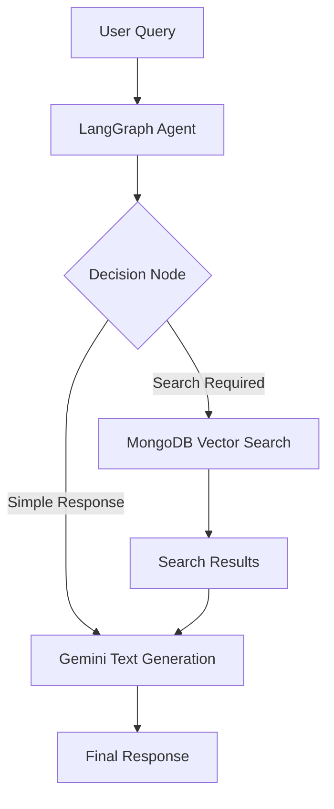

# AI Phone Shopping Agent with LangGraph.js & MongoDB

<div align="center">


**An agentic shopping assistant that understands, acts, and adapts like a human sales associate.**

</div>

---

## Tech Stack

| Layer               | Technology                    | 
| ------------------- | ----------------------------- | 
| **AI & Reasoning**  | LangGraph.js + Google Gemini  | 
| **Database**        | MongoDB Atlas (Vector Search) | 
| **Backend**         | Node.js + Express             |
| **Frontend**        | React + Fetch API             |
| **Embedding Model** | OpenAI Embeddings             |

---

## Architecture Overview



**Flow summary:**

1. User messages are sent to the backend.
2. LangGraph agent decides whether to query the database or respond directly.
3. Vector search retrieves relevant product data from MongoDB.
4. The LLM composes a natural response and returns it to the frontend.

---

## Setup Instructions

### 1. Clone the Repository

```bash
git clone https://github.com/kubowania/ecommerce-chat-helper
cd ecommerce-chat-helper
```

### 2. Backend Setup

```bash
cd server
npm install
```

Create a `.env` file:

```env
GOOGLE_API_KEY=your_google_api_key
MONGODB_ATLAS_URI=your_mongodb_uri
```

### 3. Seed the Database

```bash
npm run seed
```

This step generates synthetic product data, embeddings, and stores them in MongoDB.

### 4. Start the Backend

```bash
npm run dev
```

Server runs at **[http://localhost:8000](http://localhost:8000)**

---

### 5. Frontend Setup

```bash
cd ../client
npm install
npm run start
```

Frontend runs at **[http://localhost:3000](http://localhost:3000)**

---

## Example Interaction

**New conversation:**

```bash
curl -X POST -H "Content-Type: application/json" \
-d '{"message": "Show me modern phones"}' \
http://localhost:8000/chat
```

**Response:**

```json
{
  "threadId": "1703123456789",
  "response": "Here are some phone modles that have good features and you might like..."
}
```

**Continue the chat:**

```bash
curl -X POST -H "Content-Type: application/json" \
-d '{"message": "What’s the price range?"}' \
http://localhost:8000/chat/1703123456789
```

---

## Prompt Design & Safety Strategy

### Prompt Design

The system prompt defines the agent’s **role and goals**:

* Understand natural language shopping queries.
* Choose actions (search vs. response) autonomously.
* Maintain conversational continuity.
* Respond concisely and factually.

**Prompt structure:**

1. **Role definition:** Sales assistant helping users browse items.
2. **Context awareness:** Maintain thread-level memory for context.
3. **Tool usage:** Call MongoDB vector search when relevant.
4. **Fallback strategy:** If search fails, use Gemini’s knowledge base.

### Safety & Reliability

* **Content filtering:** Inputs are sanitized before sending to Gemini.
* **Error handling:** Network and model errors return graceful fallbacks.
* **Privacy:** No user data or chat history stored permanently.
* **Rate limiting:** Optional throttling layer prevents abuse.

---

## Known Limitations

| Type                 | Description                                                      |
| -------------------- | ---------------------------------------------------------------- |
| **Data realism**     | Product data is synthetic and may not reflect real catalogs.     |
| **Search precision** | Vector search quality depends on embedding accuracy.             |
| **Cost sensitivity** | Real API calls to Gemini/OpenAI incur usage costs.               |
| **Context depth**    | Long conversations may lose precision after multiple turns.      |
| **Frontend UI**      | Demo chat interface is minimal and not optimized for production. |

---
